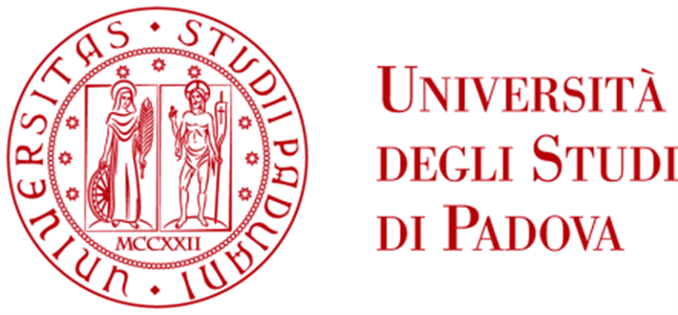

Le mie tesi di laurea in Ingegneria dell'energia & Ingegneria energetica all'Università di Padova:
1. triennale, su `Le caldaie per il riscaldamento degli edifici: analisi della tecnologia`
2. magistrale, su `Efficienza energetica: audit e investimenti in Grafica Veneta S.p.A.`

Navigazione:
* ognuna delle 2 cartelle contiene una tesi
* `tesi.pdf` è l'elaborato completo e `breve_presentazione.pdf` contiene 12 slide per illustrarla brevemente

Il mio curriculum è su [linkedin](https://it.linkedin.com/in/manuel-campello-268315137).
